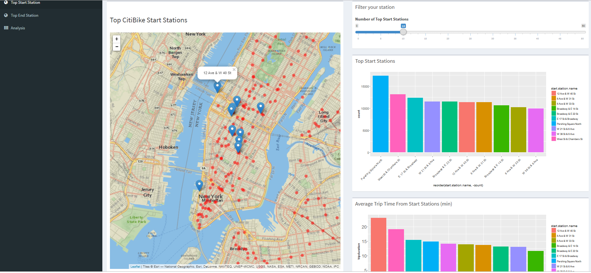

# CitiBike project
This R-shiny app shows CitiBike stations with subway stations on the map. It allows users to select top start and end stations and show the number of trips and average trip duration in each station.

There's a detailed analysis in the `Analysis` tab of the app.